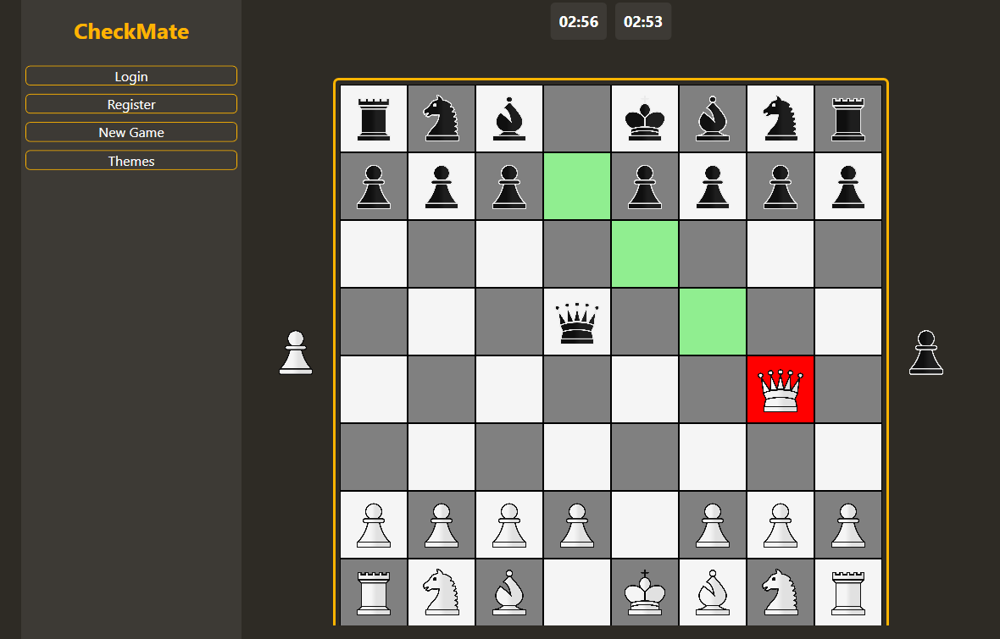

# ChessWPF



A modern chess application built with WPF (.NET 8.0) that offers both local multiplayer and AI opponent gameplay with multiple difficulty levels.

## Features

- **Elegant WPF Interface**: Clean and intuitive chess board with piece highlighting and move suggestions
- **Multiple Game Modes**: Play against another person locally or challenge the AI
- **AI Difficulty Levels**: Choose between Easy, Medium, and Hard AI opponents
- **User Authentication**: Register and login to track your games
- **Time Controls**: Multiple time formats available (3, 5, 10 minutes)
- **Game Features**: 
  - Castling
  - En passant
  - Pawn promotion
  - Check and checkmate detection
  - Stalemate detection
- **Game History**: Track captured pieces during gameplay
- **Settings**: Customize your gameplay experience

## Technologies Used

- **Framework**: .NET 8.0 with WPF (Windows Presentation Foundation)
- **Language**: C#
- **Database**: MySQL for user authentication and game history
- **Architecture**: MVVM pattern for clean separation of concerns
- **AI**: Custom chess engine with negamax algorithm and alpha-beta pruning

## Installation

### Prerequisites
- Windows OS
- .NET 8.0 Runtime or SDK

### Setup
1. Clone the repository:
   ```
   git clone https://github.com/yourusername/ChessWPF.git
   ```
2. Open the solution in Visual Studio
3. Restore NuGet packages
4. Build the solution
5. Run the application

## How to Play

1. **Start**: Launch the application
2. **Login/Register**: Create an account or login
3. **Main Menu**: Select game mode, time control, and difficulty (if playing against AI)
4. **Game**: 
   - Click on a piece to select it
   - Click on a highlighted square to move the selected piece
   - For pawn promotion, a dialog will appear to choose the promotion piece
   - The game automatically detects check, checkmate, and stalemate conditions

## AI Difficulty Levels

- **Easy**: Looks 2 moves ahead, suitable for beginners
- **Medium**: Looks 3 moves ahead, challenging for casual players
- **Hard**: Looks 4 moves ahead, provides a significant challenge

## Game Rules

The application follows standard chess rules including:

- Pieces move according to traditional chess rules
- Castling is available when neither the king nor the involved rook has moved
- En passant capture is available when conditions are met
- Pawns automatically promote when reaching the opposite end of the board
- Check must be addressed immediately
- Checkmate ends the game with a win for the attacking player
- Stalemate results in a draw

## Contributing

Contributions are welcome! Please feel free to submit a Pull Request.

## Acknowledgments

- Chess piece images from [Chess.com](https://www.chess.com)
- Special thanks to all contributors
